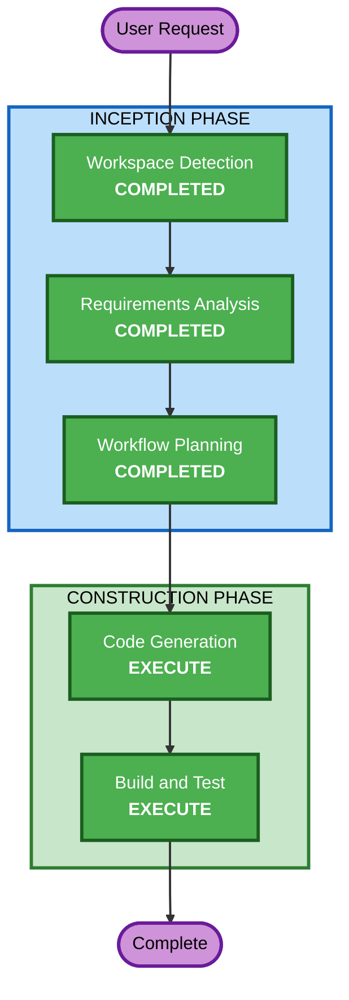

# Execution Plan

## Detailed Analysis Summary

### Change Impact Assessment
- **User-facing changes**: Yes — entire game is a new user-facing application
- **Structural changes**: Yes — new project structure from scratch
- **Data model changes**: No — only localStorage for high score
- **API changes**: No — standalone browser game
- **NFR impact**: Yes — performance (60fps), browser compatibility

### Risk Assessment
- **Risk Level**: Low (greenfield, no existing systems affected)
- **Rollback Complexity**: Easy (no dependencies, no deployment)
- **Testing Complexity**: Simple (manual play-testing, browser console)

## Workflow Visualization



### Text Alternative
```
Phase 1: INCEPTION
- Workspace Detection (COMPLETED)
- Requirements Analysis (COMPLETED)
- Workflow Planning (COMPLETED)

Phase 2: CONSTRUCTION
- Code Generation (EXECUTE)
- Build and Test (EXECUTE)
```

## Phases to Execute

### INCEPTION PHASE
- [x] Workspace Detection (COMPLETED)
- [x] Reverse Engineering (SKIPPED - greenfield)
- [x] Requirements Analysis (COMPLETED)
- [x] User Stories (SKIPPED - user declined, single-player game with clear mechanics)
- [x] Workflow Planning (COMPLETED)
- [x] Application Design - SKIP
  - **Rationale**: Single-component game, Phaser.js provides the architectural pattern (scenes). No complex service layer or multi-component design needed.
- [x] Units Generation - SKIP
  - **Rationale**: Single unit of work — one game application. No decomposition needed.

### CONSTRUCTION PHASE
- [ ] Functional Design - SKIP
  - **Rationale**: Game logic is well-understood (gravity, flap, collision, scoring). Phaser.js patterns are standard. No complex business rules requiring detailed design.
- [ ] NFR Requirements - SKIP
  - **Rationale**: NFRs are straightforward (60fps, browser compat) and already captured in requirements. No complex performance or security design needed.
- [ ] NFR Design - SKIP
  - **Rationale**: NFR Requirements skipped, no NFR design needed.
- [ ] Infrastructure Design - SKIP
  - **Rationale**: No cloud infrastructure. Static HTML/JS served from filesystem or any static host.
- [ ] Code Generation - EXECUTE (ALWAYS)
  - **Rationale**: Implementation of the game is the core deliverable.
- [ ] Build and Test - EXECUTE (ALWAYS)
  - **Rationale**: Build instructions and testing guidance needed.

### OPERATIONS PHASE
- [ ] Operations - PLACEHOLDER

## Estimated Timeline
- **Total Stages to Execute**: 2 (Code Generation + Build and Test)
- **Estimated Duration**: Single session

## Success Criteria
- **Primary Goal**: Playable Flappy Kiro game in the browser
- **Key Deliverables**: 
  - Working Phaser.js game with all required mechanics
  - Start screen, gameplay, and game-over screen
  - Sound effects with mute toggle
  - Parallax background
  - High score persistence
  - Hand-drawn visual style
- **Quality Gates**: 
  - Game runs at 60fps
  - All controls responsive
  - Score tracking works correctly
  - Sound plays and mute works
